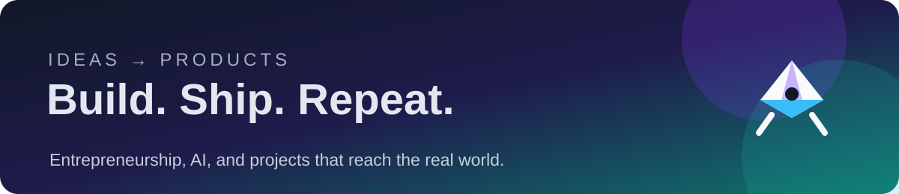

# Hey, I'm PowMowWow 👋

**Entrepreneur who ships with AI**

---

### About

Not a developer — an entrepreneur who uses AI to build and ship products.
Currently turning ideas into reality with **Claude AI**, **Solana**, and a lot of conviction.

**Current Projects**

- 🏍️ [DIRTTIME](https://dirttime.xyz/) — Track motorcycle maintenance, log rides, and never miss service on your dirt bike.
- 🦞 [SeekerClaw](https://seekerclaw.xyz/) — A 24/7 native AI agent that lives on your Android phone.
- 🤖 [LobsterPay](https://lobsterpay.xyz/) — Permissioned Solana payments for AI agents: scoped API keys with spend limits instead of private keys.
- 🔍 [Revelo](https://revelo.me/) — AI research platform that surfaces qualitative customer insights from interviews, at scale.
- 💸 [Toppio](https://toppio.xyz/) — Top up your mobile, energy, and gas bills with crypto.
- 🍽️ [OnlyFoods](https://onlyfoods.ge/) — Discover the best places in Georgia for the dish you're craving.
- 📊 [Jobs.egod.space](https://jobs.egod.space/) — Dashboards of Georgian economic metrics (CPI, inflation, and more).
- 🧾 [waybill.ge](https://waybill.ge/) — RS.GE connector for Claude, Codex, and any AI agent.
- ⌨️ [cckeys](https://cckeys.work/) — Interactive, terminal-styled trainer to master the Claude Code CLI: shortcuts, commands, and a live keyboard map.
- 🎛️ [codexdeck](https://github.com/sepivip/codexdeck) — Turn an Ajazz stream deck into a live OpenAI Codex controller — task-lit keys, knobs, and buttons on Windows.

---

### Featured

<!-- featured:start -->
| | Repo | Description |
|---|---|---|
|  | **[SeekerClaw](https://github.com/sepivip/SeekerClaw)** | Turn your Solana Seeker (or any Android phone) into a 24/7 personal AI agent |
|  | **[claude-skill-bog-payment-gateway](https://github.com/sepivip/claude-skill-bog-payment-gateway)** | A project by sepivip |
|  | **[meta-ads-skill](https://github.com/sepivip/meta-ads-skill)** | Claude skill for running Meta (Facebook/Instagram) ads via the official Ads MCP - launch playbook, verified tool contracts, Georgia/Tbilisi recipes |
|  | **[codexdeck](https://github.com/sepivip/codexdeck)** | A project by sepivip |
<!-- featured:end -->

---

### Stack

---

---

Ideas ship faster when AI does the building 🚀

